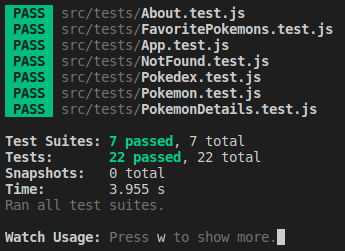

# Projeto React Testing Library

Neste projeto, fomos responsáveis por criar os testes de uma aplicação já implementada.

Os testes foram elaborados utilizando a biblioteca React Testing Library (RTL).

---

# Habilidades

- Utilizar os seletores (queries) da React-Testing-Library em testes automatizados;

- Simular eventos com a React-Testing-Library em testes automatizados;

- Testar fluxos lógicos assíncronos com a React-Testing-Library;

- Escrever testes que permitam a refatoração da estrutura dos componentes da aplicação sem necessidade de serem alterados;

- Criar mocks de APIs utilizando fetch;

- Testar inputs.

---

## Requisitos

Ao todo foram 7 requisitos:

#### 1. Teste o componente `<App.js />`;

#### 2. Teste o componente `<About.js />`;

#### 3. Teste o componente `<FavoritePokemons.js />`;

#### 4. Teste o componente `<NotFound.js />`;

#### 5. Teste o componente `<Pokedex.js />`;

#### 6. Teste o componente `<Pokemon.js />`;

#### 7. Teste o componente `<PokemonDetails.js />`.